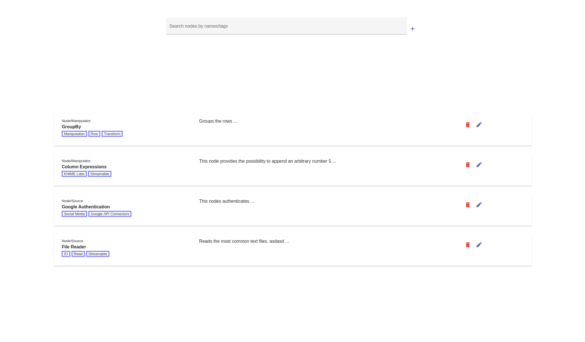

# fullstack-challenge-knime

## Description

### Setup:
  - Execute docker file for each folder, including frontend, and backend. 

### Structure:
  - Frontend: Contain the interface
  - Backend: Contain APIs service and database service. Each of them runs in a separate container.

### Instruction: 
- Search function: Use the search bar to search nodes by name or tag. The keyword belonging to the tag list will have a tag name at the beginning. Then, click to select the desired node, the selected node will be shown below.  
-  Add function: Use the add icon next to the search bar. Fill all values to all provided fields. Please note that each value in the tag field must be split by a comma. Then, click save to store the result in the database.
-  Edit function: Use the edit button in each node. Then start to edit the node information. Again, all values in the tag field must be split by a comma. Click save to update the result. 
-  Delete function: Use the delete button in each node. Click to remove the node from the database. 

